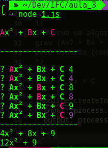
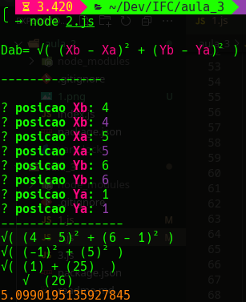
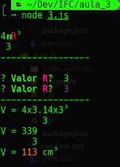

# IFC
Instituto Federal Catarinense

Repositórios oficial de projetos e tarefas 
Curso    : Ciência da computação

Aluno    : Diego Horvatti

Idade    : 19

Ano      : 2022

semestre : 1

<h3>1</h3>

<i>---------------</i>
<h3>2</h3>

<i>---------------</i>
<h3>3</h3>
