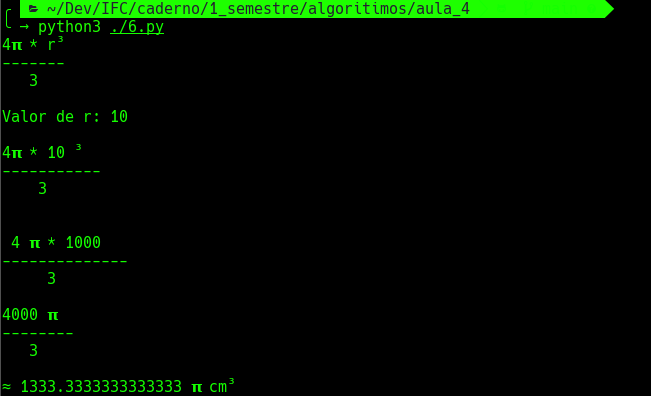
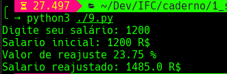
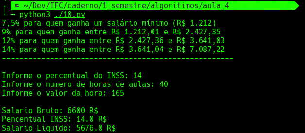
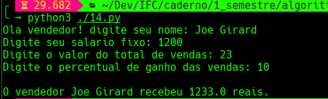
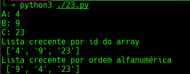
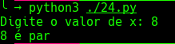
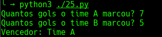
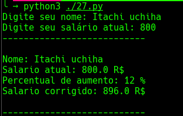

# IFC - Algoritimos
Instituto Federal Catarinense

Repositórios do meu caderno, projetos e tarefas

Curso    : Ciência da computação

Diciplina: Algoritimos

Professor: Manassés Ribeiro

Aluno    : Diego Horvatti

Idade    : 19

Ano      : 2022

semestre : 1º

Tarefa   : Exercícios obrigatórios 9, 10, 14, 23, 24 e 27

link     : https://docs.google.com/document/d/1xm2kjqZtKc_xkeqNWUjsLeQFCfkrNZUacrmz4exDFRs

Repositório: https://github.com/DIEGOHORVATTI/IFC/tree/main/caderno/1_semestre/algoritimos/aula_4

  
Observações: Nesta tarefa eu aprendi os conceitos básicos do python3 usando os algoritimos aprendido em sala de aula.  Requesitos qualquer versão a partir de 2010 do python 2 ou 3, usarei o 3 atualizado pois gosto de testar novas funcionalidades.

  <i>Execução dos arquivos↓</i>
  <!-- install -->
  <pre>sudo pacman -S python3 ou sudo apt install python3</pre>
  <!-- check -->
  <pre>python3 --version</pre>
  

<section>
  <!-- 6 -->
  

    
<b>python3 ./6.py</b>

      <ul>
        <h4>
          <a href="./6.py">
            código→
          </a>
        </h4>
        
      </ul>
  

  <!-- 9 -->
  

    
<b>python3 ./9.py</b>

      <ul>
        <a href="./9.py">
          <h4>código→</h4>
        </a>
        
      </ul>
  

  <!-- 10 -->
  

    
<b>python3 ./10.py</b>

      <ul>
        <a href="./10.py">
          <h4>código→</h4>
        </a>
        
      </ul>
  

  <!-- 14 -->
  

    
<b>python3 ./14.py</b>

      <ul>
        <a href="./14.py">
          <h4>código→</h4>
        </a>
        
      </ul>
  

  <!-- 23 -->
  

    
<b>python3 ./23.py</b>

    <ul>
        <a href="./23.py">
          <h4>código→</h4>
        </a>
        
    </ul>
  

  <!-- 24 -->
  

    
<b>python3 ./24.py</b>

      <ul>
        <a href="./24.py">
          <h4>código→</h4>
        </a>
        
      </ul>
  

  <!-- 25 -->
  

    
<b>python3 ./25.py</b>

      <ul>
        <a href="./25.py">
          <h4>código→</h4>
        </a>
        
      </ul>
  

  <!-- 27 -->
  

    
<b>python3 ./27.py</b>

      <ul>
        <a href="./27.py">
          <h4>código→</h4>
        </a>
        
      </ul>
  

</section>

 

<i>Info python↓</i>

<h3>Operadores Aritméticos</h3>
<pre>
Operador 	Nome 	Função
+ 	Adição 	Realiza a soma de ambos operandos.
- 	Subtração 	Realiza a subtração de ambos operandos.
* 	Multiplicação 	Realiza a multiplicação de ambos operandos.
/ 	Divisão 	Realiza a Divisão de ambos operandos.
// 	Divisão inteira 	Realiza a divisão entre operandos e a parte decimal de ambos operandos.
% 	Módulo 	Retorna o resto da divisão de ambos operandos.
** 	Exponenciação 	Retorna o resultado da elevação da potência pelo outro.
</pre>

<h3>Operadores de Comparação</h3>
<pre>
Operador 	Nome 	Função
== 	Igual a 	Verifica se um valor é igual ao outro
!= 	Diferente de 	Verifica se um valor é diferente ao outro
> 	Maior que 	Verifica se um valor é maior que outro
>= 	Maior ou igual 	Verifica se um valor é maior ou igual ao outro
< 	Menor que 	Verifica se um valor é menor que outro
<= 	Menor ou igual 	Verifica se um valor é menor ou igual ao outro
</pre>

<h3>Operadores de Atribuição</h3>
<pre>
Operador 	Equivalente a
= 	x = 1
+= 	x = x + 1
-= 	x = x - 1
*= 	x = x * 1
/= 	x = x / 1
%= 	x = x % 1
</pre>

<h3>Operadores Lógicos</h3>
<pre>
Operador 	Definição
and 	Retorna True se ambas as afirmações forem verdadeiras
or 	Retorna True se uma das afirmações for verdadeira
not 	retorna Falso se o resultado for verdadeiro
</pre>

<h3>Operadores de Identidade</h3>
<pre>
Operador 	Definição
is 	Retorna True se ambas as variáveis são o mesmo objeto
is not 	Retorna True se ambas as variáveis não forem o mesmo objeto
</pre>

<h3>Operadores de Associação</h3>
<pre>
Operador 	Função
in 	Retorna True caso o valor seja encontrado na sequência
not in 	Retorna True caso o valor não seja encontrado na sequência
</pre>