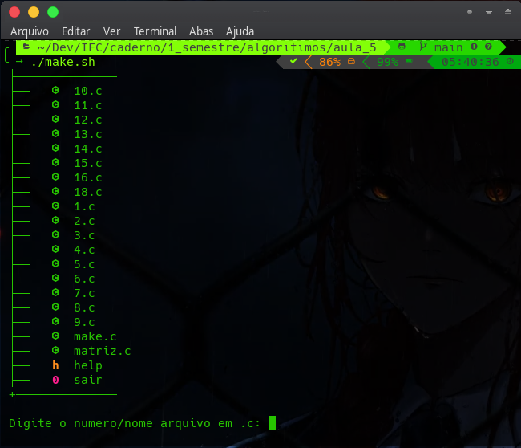
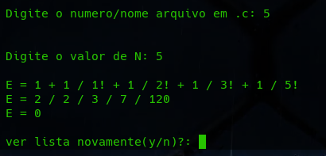
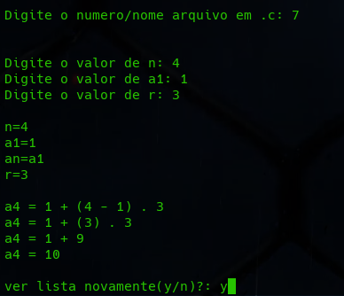
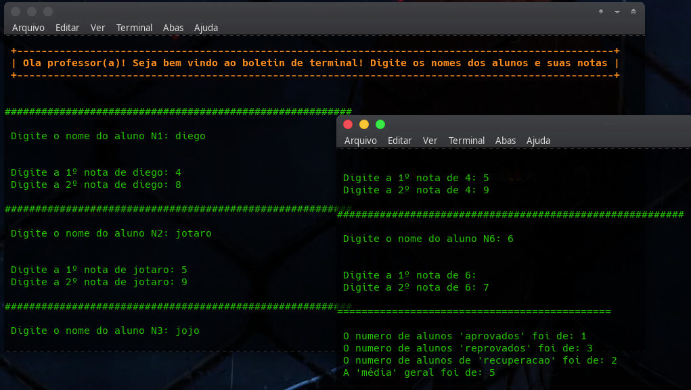

# IFC - Algoritimos
Instituto Federal Catarinense

Repositórios do meu caderno, projetos e tarefas

Curso    : Ciência da computação

Diciplina: Algoritimos

Professor: Manassés Ribeiro

Aluno    : Diego Horvatti

Idade    : 19

Ano      : 2022

semestre : 1º

Tarefa   : Exercícios obrigatórios 5, 7, 15, 18 e 19;

link     : https://docs.google.com/document/d/15rkwH4RgzNRejaZghTRIYAIVhywR5F852_JlHxwFeXE

Repositório: https://github.com/DIEGOHORVATTI/IFC/tree/main/caderno/1_semestre/algoritimos/aula_5

referencias bibiográficas: https://pt.wikipedia.org/wiki/Make | https://docs.microsoft.com/pt-br/cpp/c-language/?view=msvc-170

  
Observações: Nesta tarefa eu aprendi os conceitos básicos do shellscript usando os algoritimos aprendido em sala de aula.  Requesitos qualquer versão do bash em terminal eu usarei a versão mais recente [GNU bash, versão 5.1.16].

  <i>Execução dos arquivos↓</i>
  <!-- install -->
  <pre>sudo pacman -S bash ou sudo apt install bash</pre>
  <!-- check -->
  <pre>bash --version</pre>

  Nesta aula foi feito um "utilitário que compila automaticamente programas e bibliotecas do arquivo fonte através da leitura de instruções contidas em arquivos denominados Makefiles", 'make.sh' eu fiz um versão bem simplificada de um makefile com um help que leva para este readme na web
  
  

<section>
 
  <!-- 5 -->
  

    
<b>./make.sh 5</b>

    <ul>
        <h4>
          <a href="./5.c" target="blank">
            código→
          </a>
        </h4>
        
    </ul>
  

  <!-- 7 -->
  

    
<b>./make.sh 7</b>

    <ul>
        <h4>
          <a href="./7.c" target="blank">
            código→
          </a>
        </h4>
        
    </ul>
  

  <!-- 15 -->
  

    
<b>./make.sh 15</b>

    <ul>
        <h4>
          <a href="./15.c" target="blank">
            código→
          </a>
        </h4>
        
    </ul>
  

  <!-- 18 -->
  

    
<b>./make.sh 18</b>

    <ul>
        <h4>
          <a href="./18.c" target="blank">
            código→
          </a>
        </h4>
        
    </ul>
  

  <!-- 19 -->
  

    
<b>./make.sh 19</b>

    <ul>
        <h4>
          <a href="./19.c" target="blank">
            código→
          </a>
        </h4>
        
    </ul>
  

</section>

 

