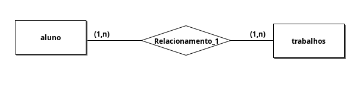
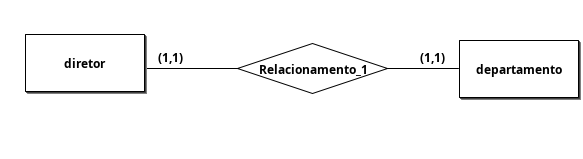
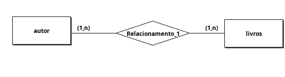
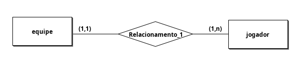
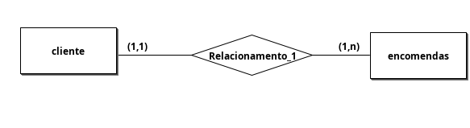

### Desenvolva o Diagrama EntidadeRelacionamento para as seguintes situações:
* Um aluno realiza vários trabalhos. Um trabalho é
realizado por um ou mais alunos.

* Um diretor dirige no máximo um departamento. Um
departamento tem no máximo um diretor.

* Um autor escreve vários livros. Um livro pode ser
escrito por vários autores.

* Uma equipe é composta por vários jogadores. Um
jogador joga apenas em uma equipe.

* Um cliente realiza várias encomendas. Uma
encomenda diz respeito apenas a um cliente.
